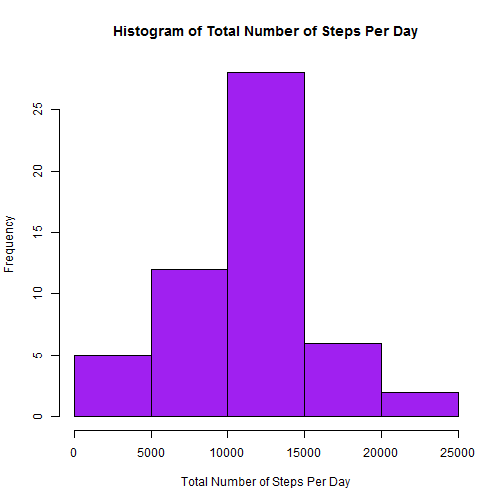
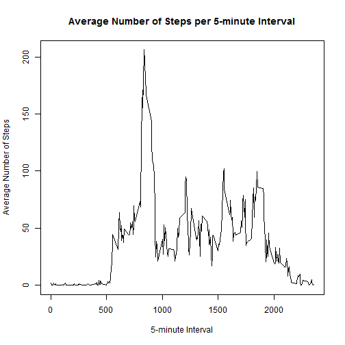
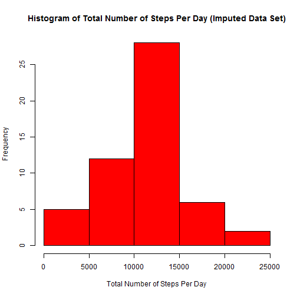
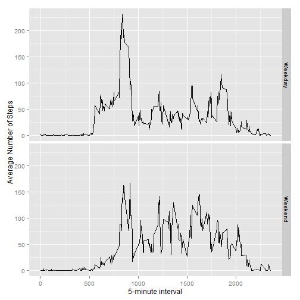

## Introduction

It is now possible to collect a large amount of data about personal movement using activity monitoring devices such as Fitbit, Nike Fuelband, or Jawbone Up. These types of devices are part of the "quantified self" movement- a group of enthusiasts who take measurements about themselves regularly to improve their health, to find patterns in their behavior, or because they are tech geeks. Buse these data remain under-utilized both because the raw data are hard to obtain and there is a lack of statistical methods and software for processing and interpreting the data.

This assignment makes use of data froma personal activity monitoring device. Thise device collects at 5 minute intervals through out the day. The data consists of two months of data from an ananymous individual collected during the months of October and November, 2012 and include the number of steps taken in a 5 minute intervals each day.

## Assignment

* Loading and preprocessing the data

The following code unzips the file containing the data set, reads the data into R, calls package(s) to be used in the analysis, and processes/transforms the data into a format suitable for downstream analysis.


```r
files.temp<-"repdata-data-activity.zip"
unzip("repdata-data-activity.zip")
Activity_DF<- read.csv("activity.csv")
library(ggplot2)
library(knitr)
Activity_DF$date <- as.Date(Activity_DF$date)
```

* What is the mean total number of steps taken per day?


```r
## Calculates the total number of steps taken per day.
Steps_per_Day <- aggregate(steps ~ date, Activity_DF, sum, na.rm=TRUE)

## Creates a histogram of the total number of steps taken per day.
hist(Steps_per_Day$steps, col="purple", xlab="Total Number of Steps Per Day", main="Histogram of Total Number of Steps Per Day")
```

 

```r
## Calculates the mean total number of steps taken per day.
mean(Steps_per_Day$steps)
```

```
## [1] 10766.19
```

```r
## Claculates the median total number of steps taken per day.
median(Steps_per_Day$steps)
```

```
## [1] 10765
```

The mean number of steps taken per day is 10,766, and the median number of steps taken per day is 10,765.

* What is the average daily activity pattern?


```r
## Calculates the mean number of steps taken per interval.
Steps_per_Interval <- aggregate(steps ~ interval, Activity_DF, mean, na.rm=TRUE)

## Generates a time series plot of the 5-minute interval and the average number of steps taken, averaged across all days
plot(Steps_per_Interval$interval, Steps_per_Interval$steps, type="l", xlab="5-minute Interval", ylab="Average Number of Steps", main="Average Number of Steps per 5-minute Interval")
```

 

```r
## Identifies the maximum number of steps that occur in an interval, and the corresponding interval.
max(Steps_per_Interval$steps)
```

```
## [1] 206.1698
```

```r
which.max(Steps_per_Interval$steps)
```

```
## [1] 104
```

The interval with the maximum number of steps is interval 104 (with 206 steps).

* Imputing missing values


```r
## Calculates the total number of missing values in the data set.
sum(is.na(Activity_DF$steps))
```

```
## [1] 2304
```

```r
## Creates a new data set that fills in NA values with the mean for the corresponding 5-minute interval.
for (i in 1:nrow(Activity_DF)){
  if (is.na(Activity_DF$steps[i])){
    interval <- Activity_DF$interval[i]
    row_id <- which(Steps_per_Interval$interval == interval)
    steps <- Steps_per_Interval$steps[row_id]
    Activity_DF$steps[i] <- steps
  }
}

## Calculates the total number of steps taken per day.
Steps_per_Day2 <- aggregate(steps ~ date, Activity_DF, sum)

## Creates a histogram of the total number of steps taken per day.
hist(Steps_per_Day$steps, col="red", xlab="Total Number of Steps Per Day", main="Histogram of Total Number of Steps Per Day (Imputed Data Set)")
```

 

```r
## Calculates the mean total number of steps taken per day.
mean(Steps_per_Day2$steps)
```

```
## [1] 10766.19
```

```r
## Claculates the median total number of steps taken per day.
median(Steps_per_Day2$steps)
```

```
## [1] 10766.19
```

There are 2,304 missing values in the data set. The mean and median total number of steps per day, for the imputed data set, is 10,766. The mean remains the same between the data set with removed NA values, and the imputed data set. However, the median slightly increases from 10,765 (for the data set with removed NA values) to 10,766 (for the imputed data set). This was probably due to the method that was used to impute the NA values, which was to use the average value for the particular 5-minute interval that was missing.

* Are there differences in activity patterns between weekdays and weekends?


```r
## Creates a new factor variable in the dataset indicating whether a given date is a weekday or a weekend day.
Activity_DF$Day <-  ifelse(as.POSIXlt(Activity_DF$date)$wday %in% c(0,6), 'Weekend', 'Weekday')

## Makes a panel plot containing a time series plot of the 5-minute interval and the average number of steps taken, averaged across all weekday days or weekend days.
Steps_per_Interval2 <- aggregate(steps ~ interval + Day, data=Activity_DF, mean)
ggplot(Steps_per_Interval2, aes(interval, steps)) + geom_line() + facet_grid(Day ~ .) + xlab("5-minute interval") + ylab("Average Number of Steps")
```

 

There are differences between the weekends and weekday. It appears that during the week, there is a peak in average steps taken per interval a little before the 1000 5-minute interval, and lower activity throughout the remainder of the intervals. Whereas, on the weekends, the average number of steps per interval is more steady throught the day, but there is still a bit of a peak before the 1000 5-minute interval.
